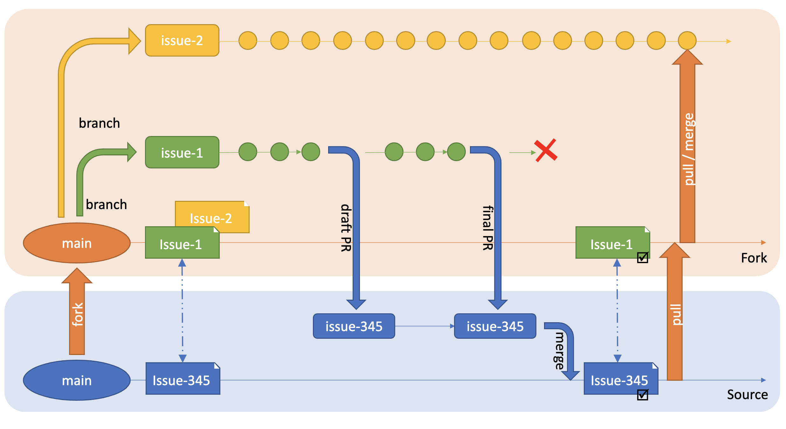

# Contributing

`woke` is an Open Source project that started when I realized there weren't any OSS tools to catch insensitive and non-inclusive language within source code.

By participating in this project, you agree to abide by this projects [Code Of Conduct](./CODE_OF_CONDUCT.md).

`woke` is essentially a **language-agnostic linter**. I've taken my favorite parts of other linters
and used that as a guiding force.

## Rules

A few rules for when contributing to this project:

* The goal of this project is to identify places within text files where better, inclusive language can be used. Please don't make contributions that don't push this goal forward.
* This project is not the forum to determine _what_ is inclusive language and _what_ is insensitive language. Contributions should be limited to providing consumers of `woke` the ability to make their own decisions regarding conscious language.
* You will participate in discussions that embody the spirit of this project and work towards building a healthy, supportive, and productive culture, and an environment where everyone feels welcome and included.
* If you're adding linter-based features, try to link to other well-known linters as a reference for why you want the feature added and what benefit it provides.
* Programming language-specific changes should be avoided at all costs. Please keep this project programming language-agnostic.

**If you do not abide by these rules, _this is your only warning_ and you will be blocked and reported immediately if I find your contributions do not embody the spirit of the project.**

## How to contribute

1. Fork, then clone the repo:

        git clone git@github.com:your-username/woke.git

1. Setup ([Dev Container](https://code.visualstudio.com/docs/remote/containers))
   1. Add VS Code [Remote Container Extension](https://marketplace.visualstudio.com/items?itemName=ms-vscode-remote.remote-containers)
   1. Remote-Containers: Open Folder in Container... command from the Command Palette (`F1`) or quick actions Status bar item on the bottom left of VS Code
1. Or Setup (Manual)
   1. [Install go](https://golang.org/doc/install)
   1. [Install pre-commit](https://pre-commit.com/#install) and run `pre-commit install`
   1. Install required packages for pre-commit (there might be more, here are a few... see [`pre-commit-config.yaml`](.pre-commit-config.yaml))
      1. `go install github.com/fzipp/gocyclo`
      1. `go install golang.org/x/tools/cmd/goimports`
      1. [`golangci-lint`](https://golangci-lint.run/usage/install/#local-installation)

1. Make your changes and add tests for your change. Make sure tests pass

        go test ./...

1. Push to your fork and submit a pull request. Fill out the Pull Request template thoroughly. I expect contributions to be thoughtful, have tests that are meaningful, and to be considerate of others who use this tool.

At this point you're waiting on the maintainers. Since this is a personal project, I make no guarantees
on response time, but I will do my absolute best because I care about this tool.
I may suggest some changes or improvements or alternatives and reserve the right to reject your contribution if
I find it does not promote the spirit of this project.

Some things that will increase the chance that your pull request is accepted:

* Write good tests, CI will tell if if your PR reduced the overall code coverage.
* Follow Go's [style guide](https://golang.org/doc/effective_go.html).
* Write a [good commit message](http://tbaggery.com/2008/04/19/a-note-about-git-commit-messages.html).

## Proposed Interaction Model 

Because your team is collaborating on a FORK of a repo into which you will eventually seek to merge contributions, special care must be taken for your team to operate in a way that is amenable each of the following objectives:
* having a workspace for the team to collaborate on in-progress work in compliance with our self-managed engineering processes that is separate from the original/source OSS repo (your fork)
* having a workspace that supports easy contribution of approved work back to the original/source OSS repo in a manner that doesn't negatively impact the commit history, etc. of the original/source repo.

If your team is collaborating and contributing to woke, you can use the below documented workflow to handle issue types, merging and PRs between your forked repository and woke repository. 
